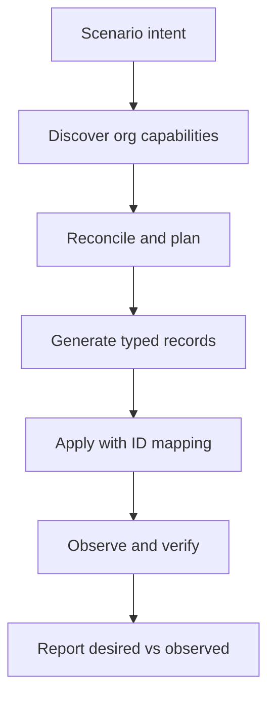

# Reflective generation: from intent to verified state

Status: design exploration, 29 September 2026. This document extends the [SDD](sdd.md). It describes the proposed behavior, not a feature already implemented.

## The central idea

A recipe expresses **intent**: what test situation should exist and why. The org supplies **constraints**: schema, field writability, permissions, data types, dependencies, and business automation. A plan joins those two inputs into an executable proposal. The **observed state** is read back after the write. Harvester reports whether that state satisfies the desired scenario.

We need not expose these exact nouns as command names. The important distinction is that a JSON recipe is not proof that the target org can accept its records, and an API success response alone is not proof that the resulting graph has the intended meaning.



### Example

Intent: “one Account with two Contacts and an open Opportunity, where both Contacts belong to that Account.” The target may lack Create permission on Opportunity; its StageName may not accept the proposed value; a custom required field may exist; a validation rule may reject the combination; a flow may alter the Opportunity after insert. Harvester should identify what it can before generating final values, explain what remains uncertain, and read back the relationships and status afterward.

## The inspection model

| Layer | Inspect | Consequence for plan |
| --- | --- | --- |
| Org and execution identity | Org ID, instance, sandbox/scratch classification, API version, authenticated user, source/target distinction | Confirm destination and reject unsupported writes |
| Object | Object availability and `createable`; queryability for read-back | Reject an unwritable node or state a verification limit |
| Field | Existence, `createable`, calculated/autonumber, type, length, precision, scale, `nillable`, `defaultedOnCreate`, restricted picklist, reference targets | Do not write formula or other read-only values; generate type-correct values; identify required inputs |
| Record type | Available record types and record-type-specific picklist values where the chosen API supports them | Select an accessible record type and compatible values; do not rely on a general picklist list alone |
| Relationship | Lookup/master-detail target, required parent, self-reference, polymorphic reference, existing parent access | Order writes, map IDs, or reject an unsupported graph |
| Data | Uniqueness/external ID strategy, existing records, candidate collisions, source selection and field transforms | Define repeat-run behavior and avoid silent duplicates |
| Execution | API limits, batch size, errors, target automation and potential side effects | Choose bounded operations and explain residual risk |

Object and field `createable` values are evaluated for the **authenticated user**; Harvester must inspect the same principal that will write. Formula and autonumber fields are generally read-only; the operational test is field createability, not a hard-coded type blacklist. A field that is non-nillable may still have a create default. Fields required by validation rules, triggers, managed packages, and flows may not be discoverable as a complete static set. Layout-required fields are not necessarily API-required. The plan should label checks as **proven**, **warning**, or **unknown**, and should not claim perfect validation. Salesforce describes object/field properties and notes the API versus page-layout distinction in its own references.[1][2][3]

## Reconciliation algorithm (proposed)

1. Parse the recipe and validate keys, counts, generator names, and relationship references without contacting an org.
2. Inspect the target org and effective user. Cache describe results only for the plan; record API version and inspection time.
3. For each requested field, classify: writable; omitted because Salesforce computes/defaults it; requires a generator or explicit value; incompatible type/length/picklist/reference; or unknown.
4. Build an object dependency graph and identify prerequisites. A required parent must have a target record or a node that can be created earlier. Handle cycles only with a supported second pass and update permission; otherwise reject.
5. Resolve value generators against the inspected field constraints. Generate deterministic values from seed plus stable node/record key. Do not generate first and then silently truncate or coerce.
6. Check chosen record types, uniqueness strategy, and visible existing records. Warn that target state can change between plan and apply.
7. Produce a plan with target org ID, running user, intended counts, chosen fields/generators, dependency order, permission findings, transformations, expected API calls, and uncertainties.
8. At apply time, recheck target identity and critical permissions/metadata. Refuse if the plan is stale or materially different. Confirm an explicit target.
9. Insert parents, capture IDs, insert children with resolved lookups, classify per-record failures, and preserve a resumable manifest. Never silently drop a relationship or convert a failed insert into success.
10. Query the created graph as the same principal. Compare observed counts, relationships, selected field values, and any declared business predicates to intent; report **satisfied**, **partially satisfied**, **failed**, or **unverifiable**.

The desired state is a **predicate over observable records**, not a promise to continually reconcile forever. Repeated execution needs an explicit policy such as fail-if-present, named-run reuse, or upsert on a configured external ID. Continuous synchronization is out of scope.

## A sample report shape

```text
Scenario: account-opportunity     Target: QA sandbox (org ID …)
Plan: 1 Account, 2 Contacts, 1 Opportunity
Checks: 17 passed, 1 warning, 1 blocked
Blocked: Opportunity.StageName “Prospecting” unavailable for selected record type
Warning: target automation may modify or reject the records
Writes: 0 (blocked before apply)
Desired state: not evaluated
```

After a successful apply, the report should replace that last line with observed counts, relationship checks, predicate results, and failed/unverifiable checks. Store IDs and policy identifiers, never access tokens or unmasked personal data.

## What the existing tools do

This is a comparison of **documented capabilities**, not a feature audit or a claim that a vendor lacks undocumented functionality.

| Tool | Documented capabilities relevant here | What Harvester should test as its own emphasis |
| --- | --- | --- |
| Salesforce CLI | Tree export/import for small related data; Bulk API 2.0 commands for large datasets; `sf sobject describe` exposes org metadata.[4][5][6] | A declarative scenario whose generators adapt to effective target schema and whose final record graph is verified against predicates |
| Gearset | Sandbox seeding from production or another sandbox; object relationship selection, masking, and data problem analyzers that flag missing parents and some permission/record-type problems.[7][8][9] | Git-reviewed, deterministic *synthetic* scenarios and an explicit desired-versus-observed report, validated through hands-on comparison |
| Copado Data Deploy | Data templates with relationship diagram, filters on child templates, record matching to avoid duplicates, and validation deployment described in its release documentation.[10][11] | A small developer-oriented CLI workflow and explainable per-field generation choices, subject to product comparison |

We should not claim that Harvester invented preview, masking, graph handling, or duplicate detection. Those are established capabilities. The hypothesis is that a **reflective generator**—inspecting the effective target before choosing values, then verifying a versioned scenario's predicates afterward—makes test setup easier to reason about. Validate that hypothesis with actual teams and representative Copado/Gearset workflows before claiming differentiation.

## Research and source notes

1. [Salesforce sObject Describe REST resource](https://developer.salesforce.com/docs/platform/api-rest/guide/resources-sobject-describe.html) and [DescribeSObjectResult field properties](https://developer.salesforce.com/docs/platform/api/guide/sforce-api-calls-describesobjects-describesobjectresult.html).
2. [Salesforce create call: object createability](https://developer.salesforce.com/docs/platform/api/guide/sforce-api-calls-create.html).
3. [Salesforce API call basics: UI layout/record type distinctions](https://developer.salesforce.com/docs/platform/api/guide/calls.html); [record-type picklist metadata](https://developer.salesforce.com/docs/platform/graphql/guide/query-objectinfo.html).
4. [Salesforce CLI tree export](https://developer.salesforce.com/docs/platform/salesforce-cli-reference/guide/cli_reference_data_export_tree.html) and [tree import](https://developer.salesforce.com/docs/platform/salesforce-cli-reference/guide/cli_reference_data_import_tree.html).
5. [Salesforce CLI large datasets](https://developer.salesforce.com/docs/platform/sfdx-dev/guide/sfdx-dev-data-bulk.html).
6. [Salesforce CLI sObject describe](https://developer.salesforce.com/docs/platform/salesforce-cli-reference/guide/cli_reference_sobject_describe.html).
7. [Gearset sandbox seeding](https://docs.gearset.com/en/articles/13112693-running-your-first-sandbox-seeding-job).
8. [Gearset sandbox seeding problem analyzers](https://docs.gearset.com/en/articles/14999375-sandbox-seeding-problem-analyzers).
9. [Gearset data problem analyzers](https://docs.gearset.com/en/articles/7888020-an-introduction-to-gearset-s-data-problem-analyzers).
10. [Copado Data Deploy relationship filters and automatic record matching](https://docs.copado.com/articles/?_escaped_fragment_=release-notes-publication%2Fwinter-21-release-notes).
11. [Copado validation deployment in Data Templates](https://docs.copado.com/articles/release-notes-publication/summer-21-release-notes/a/h2__146634055).

The competitor descriptions are based on public documentation as of 29 September 2026. A direct product exercise is still needed to assess usability and exact feature coverage.
