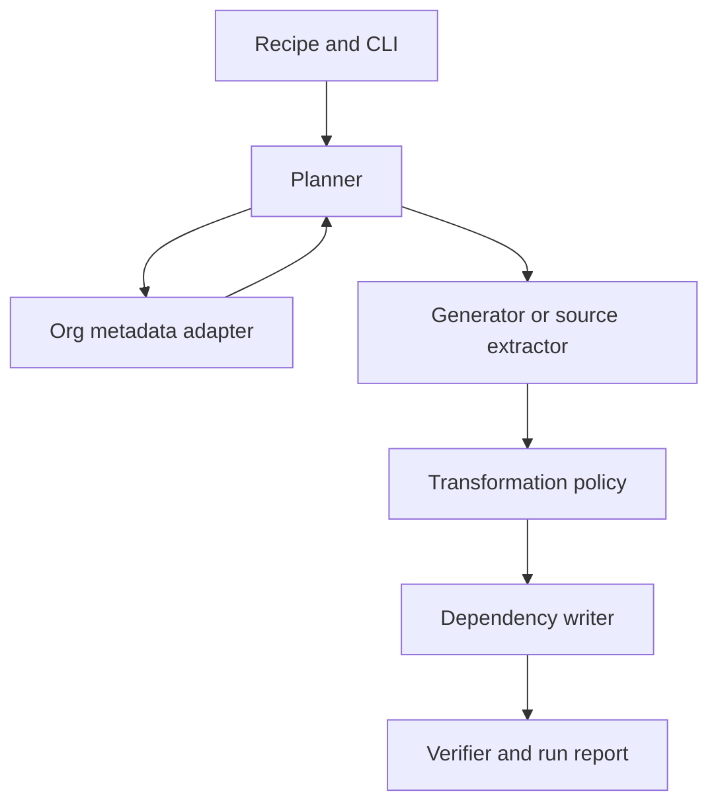

# Software Design Document — Harvester

Status: **Draft 0.1**, 29 September 2026. This document describes intended behavior; implementation has not begun.

## 1. Goals

1. Generate related, realistic, repeatable records in Salesforce sandboxes and scratch orgs from a versioned recipe.
2. Preview the target-specific write plan before execution.
3. Later, select and recreate a bounded record graph between sandboxes, with explicit transformation of sensitive fields.
4. Make runs auditable, resumable where possible, and useful for teaching Salesforce data architecture.

Non-goals for the first release: metadata deployment, production targets, arbitrary objects, bidirectional sync, full backup/restore, and a web UI.

## 2. Users and first journey

A developer has two authenticated org aliases and a scenario recipe in Git. For M1, they target a scratch org, preview an Account with related Contacts, approve the plan, and load it. Harvester reports the created IDs and verifies each Contact points to the Account. The same seed gives the same generated values, except for fields that must be unique in the target. A repeat run must follow an explicit duplicate policy rather than silently insert copies.

M3 adds a selected source Account graph. Harvester queries an allowlisted slice, replaces sensitive values, maps source IDs to new target IDs, writes parents before children, and verifies the reconstructed links.

## 3. Conceptual architecture



The planner produces an immutable in-memory plan containing target identity, object/field checks, cardinalities, dependency order, intended transformations, and warnings. Execution consumes a plan only after the target is confirmed. The adapter isolates Salesforce authentication, describe/query, and write operations from core planning logic.

## 4. Repository layout

```text
docs/
  motivation.md
  sdd.md
  adr/
examples/
  account-opportunity.json
src/
  cli/           command entry points and confirmation
  core/          recipe, graph, planner, policies, run state
  salesforce/    auth, describe, query, write adapters
test/
  fixtures/      synthetic metadata and records only
  integration/   opt-in scratch org tests
```

Directories under `src/` and `test/` are reserved for implementation; no runtime is implied by their presence.

## 5. Recipe contract (proposed)

A recipe has a version, scenario name, deterministic seed, nodes, counts, field values or generators, and relationships. Nodes use stable local keys. A relationship points from a child's lookup field to another node key. The [example](../examples/account-opportunity.json) illustrates the shape. The schema and generator vocabulary are provisional until M1 implementation and validation.

Org aliases and secrets do **not** belong in the recipe. Execution supplies target and, for harvest, source aliases separately. A recipe must not rely on Salesforce record IDs surviving across orgs.

## 6. Planning and execution

1. Parse and validate the recipe locally, including uniqueness of node keys and relationship references.
2. Resolve authenticated org aliases and inspect org IDs and sandbox/scratch status; reject unsupported targets.
3. Describe selected objects and fields in the target. Check create access, required fields, picklist values, lookup targets, and differences in metadata. Report checks the API cannot reliably prove as uncertainties.
4. Build a dependency graph. Topologically order acyclic writes. For cycles or self references, either use an explicit second pass when fields permit it or fail with an actionable explanation. Never silently omit a lookup.
5. Generate or extract a bounded dataset. Apply field policies before a harvested dataset can be persisted or written.
6. Show a read-only preview: org identity, counts, fields, transforms, dependency order, likely automation effects, and unresolved issues. Preview must not invoke mutating APIs.
7. Require explicit target confirmation for apply. Write in bounded batches, record outcomes, maintain local-key/source-ID to target-ID mappings, and resolve child lookups.
8. Read back selected records to verify counts and relationships. Report successes and failures per node and record.

Salesforce validation rules, triggers, and flows may still reject or alter writes. Harvester must surface those results; it must not disable automation automatically.

## 7. Identity, repeat runs, and recovery

Generated values are deterministic from recipe seed and stable local record keys, but Salesforce IDs are assigned per org. The run manifest maps local/source keys to target IDs. M1 must choose and implement an explicit `fail-if-present` or named-run policy before writes; upsert requires a configured external ID and is not assumed. A partial run must report exactly what was created and provide safe resume or cleanup guidance. There is no promise of a transaction across a multi-object run.

Run reports should omit tokens and raw sensitive field values. Default local reports should be ignored by Git.

## 8. Security and privacy

Sandbox and scratch targets only in initial releases. Source selection and object/field allowlists are explicit. Harvesting personal data requires a field-level transform policy; unknown or unclassified sensitive fields fail closed or are excluded. Preserve referential consistency when replacing values. Credentials use the authenticated Salesforce CLI context or an equivalent secure provider; never store refresh tokens in recipes or logs. Redaction, retention, and destination controls are specified in [ADR 0004](adr/0004-data-safety.md).

## 9. API strategy and constraints

Use Salesforce describe and query APIs for metadata-aware planning. M1 can use bounded REST/composite writes for small graphs; a later bulk adapter addresses large datasets. The API choice is behind an adapter, with limits, retries, and error classification measured rather than assumed. Tree import/export and Bulk API remain useful reference workflows, not internal requirements.

## 10. First acceptance test

Given a scratch org with required metadata and permissions, an M1 recipe creates one Account and two Contacts. Preview makes zero writes and names the correct org. Apply produces three records; both Contacts reference the new Account. A malformed lookup, missing required field, or unsupported target fails before any write where detectable. A rerun follows the documented duplicate policy. The report records created IDs and partial failures without credentials or personal data.

M2 proves Opportunity and line items after resolving Product, active Pricebook, and PricebookEntry prerequisites. M3 proves a bounded masked Account graph copied from sandbox A to sandbox B with new IDs and intact links.

## 11. Open questions

- Which first users and real scenarios should determine recipe ergonomics?
- How should a run be named and rediscovered after local state is lost?
- Which standard objects and custom object patterns belong in M2?
- What minimum masking policy is acceptable for harvest mode?
- Which Salesforce automation effects can be estimated in preview, and which must remain warnings?

These questions should be resolved with implementation evidence and subsequent ADRs.
